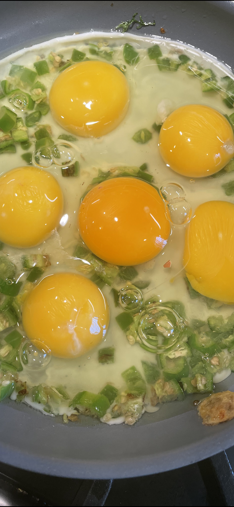

# Introduction

My health plan is focused on managing my insulin resistance.  Here are the key facets:
1. High Quality Food
2. [Ketogenic (Low Carbohydrate / High Fat)](https://www.dietdoctor.com/low-carb/keto/u7)
3. Intermittent Fasting (One Meal a Day)
4. Exercise
5. Sleep (work in progress)
6. Meditation (work in progress)

# My Religion

Since I began my personal health crusade I've dove very deep on the
topic of personal health and nutrition and have done quite a bit of
research.  Through that process I've developed some strong views, all
of which are loosely held, and evolving virtually daily.  Here's a
quick snapshot of my current perspective:

- **Change**: I changed five things to get healthier: (1) dramatically
  increased the quality of the food I consumed, (2) changed when I
  ate, (3) added a walking exercise program, (4) went on a low carb
  high fat Keto based diet, and (5) improved my sleep habits.  If I
  had to give up four of those and pick the one that I think most
  impacts my health it would be intermittent fasting (although sleep
  is the easiest to fix).  That said, they all work together to tackle
  components of insulin management and I'd be hard pressed to give any
  of them up as I think they are all pretty critical.

- **Longevity**: I've come to the view that it's all about longevity,
  both health span (quality of life) and life span (length of life).
  All my views are measured against the meta goal of longevity.  Based
  on existing and ongoing clinical studies and research (eg David
  Sinclair @ Harvard, Matt Kaeberlein @ Univ of Washington, David
  Sabatini @ MIT, Steve Horvath @ UCLA) I now believe there are
  mechanisms that can attack the process of aging reversing the effect
  of aging on parts of the body resulting in extending health/life
  span and (eg sirtuins, rapamycin, mTOR, metformin, et al).  This is
  an extremely hot and very active field of research, breakthroughs
  are imminent, and Nobel Prizes await the winners.

- **Insulin**: One of the most important things I've learned is that
  insulin resistance is the foundational element of most health issues
  (well beyond diabetes, including high blood pressure, many forms of
  cancers, heart disease, and most forms of alzheimers).  Insulin
  resistance is the primary driver now of all my short term exercise
  and dietary tactics.  This is why I've adopted a Keto based
  lifestyle dramatically restricting my carboyhydrate consumption and
  enabling an alternative fuel source.

- **Nutrition vs Exercise**: I now believe both what you eat and when
  you eat are far more important components of health than exercise
  (8:2 or 9:1).  I've always had this one completely upside down, and
  I wish I'd come to this conclusion far sooner.

- **When**: I now believe that when you eat is actually more important
  than what you eat (assuming you eat a quasi healthy diet).  This was
  the most eye opening thing I've discovered thus far.  Intermittent
  fasting is in my view the easiest way to fight insulin resistance
  and the quickest way to impact your health positively.

- **Walking**: Walking is a far better form of exercise than I'd
  previously understood.

- **Fruit**: Everyone should be well informed on non-alcoholic fatty
  liver disease (NAFLD), its health implications, and what the source
  is (corn syrup/frustose and thus processed foods and fruits).

- **Antiquated Thinking**: Most doctors are still working from
  antiquated scripts (forgive me if you're an MD).  Calories in,
  calories out, fat is bad, high HDL is good, et al.  Oddly enough,
  doctors are not trained in nutrition.  Like politics and COVID,
  there's a lot of "experts" with MD after their name providing a lot
  of misinformation.

- **Food Industry**: I've reaffirmed my view of the food industry.
  They are just like tobacco.  There are 10 companies with dominant
  control over 85% of the calories we consume, that use organic
  chemistry and sugar (in various forms, fructose being the worst), to
  optimize their profit margins, knowing full well the health
  pandemics they are creating in the broader population.  This is the
  ugly underbelly of capitalism.

- **Evil**: Added sugar will go down in history as this generation's
  tobacco.  Refined carbohydrates are pure evil.  Processed foods are
  essentially profit driven synthetic drugs.

# My recommendations

A couple people have asked me what I'd recommend (independent of your current health status):
- Educate yourself on the science so you know what to do and why to do it - start with [The Obesity Code (Jason Fung)](https://www.amazon.com/The-Obesity-Code-Dr-Jason-Fung-audiobook/dp/B01MRKEO0U/ref=tmm_aud_swatch_0?_encoding=UTF8&qid=&sr=) (even if you're young and in perfect health)
- Stop consuming processed foods
- Stop consuming bad oils
- Stop consuming any foods with added sugar (using any of [the 56 different names for sugar](https://www.virtahealth.com/blog/names-for-sugar))
- Dramatically reduce your consumption of sugar
- Dramatically reduce your consumption of carbohydrates
- Stop snacking between meals
- Skip breakfast
- Improve your sleep habits
- Upgrade the quality of the food that you should be consuming
- Research intermittent fasting, consider a 16:8 plan
- Research Keto and seriously consider it (for those with a BMI > 25)

# Reference

Books:
* [The Obesity Code (Jason Fung)](https://www.amazon.com/The-Obesity-Code-Dr-Jason-Fung-audiobook/dp/B01MRKEO0U/ref=tmm_aud_swatch_0?_encoding=UTF8&qid=&sr=)
* [Why We Get Sick (Benjamin Bikman)](https://www.amazon.com/Why-We-Get-Sick-Epidemic/dp/B0899DP434/ref=sr_1_1?dchild=1&keywords=why+we+get+sick&qid=1624560739&s=audible&sr=1-1)
* [Lifespan (David Sinclair)](https://www.amazon.com/Lifespan-Why-Age_and-Dont-Have/dp/1501191977)
* [The Case for Keto (Gary Taubes)](https://www.amazon.com/s?k=the+case+for+keto&gclid=CjwKCAjwieuGBhAsEiwA1Ly_nWYZi4rZGM5JfbvnAX46KVCXwmrUBM9ZYAkBmxm7A-aWdpONarFzbhoCw_AQAvD_BwE&hvadid=416744105949&hvdev=c&hvlocphy=9031975&hvnetw=g&hvqmt=e&hvrand=10029320316729189384&hvtargid=kwd-871459532323&hydadcr=22536_9636733&tag=googhydr-20&ref=pd_sl_7q2cbifsgv_e)
* [Why We Sleep (Matthew Walker)](https://fastlifehacks.com/matthew-walker-12-tips-for-good-sleep/)

Subject matter experts:
* [Peter Attia (The Drive)](https://peterattiamd.com) [--youtube--](https://www.youtube.com/channel/UC8kGsMa0LygSX9nkBcBH1Sg)
* [Jason Fung (The Fasting Method)](https://thefastingmethod.com) [--youtube--](https://www.youtube.com/user/drjasonfung)
* [Rhonda Patrick (Found My Fitness)](https://www.foundmyfitness.com) [--youtube--](https://www.youtube.com/c/FoundMyFitness/videos)
* [David Sinclair (Harvard)](https://www.youtube.com/results?search_query=david+sinclair)
* [David Sabatini (MIT)](https://www.youtube.com/results?search_query=david+sabatini)
* [Steve Horvath (UCLA)](https://www.youtube.com/results?search_query=steve+horvath)
* [Andrew Huberman (Huberman Lab)](https://www.youtube.com/channel/UC2D2CMWXMOVWx7giW1n3LIg)
* [Matthew Walker](https://www.youtube.com/results?search_query=matthew+walker)
* [Tom Bilyeu (Impact Theory/Quest)](https://impacttheory.com)
* [Mark Sisson (Mark's Daily Apple)](https://www.marksdailyapple.com)
* [Gary Taubes](https://www.youtube.com/results?search_query=gary+taubes)
* [Robert Lustig](https://www.youtube.com/results?search_query=robert+lustig)
* [Richard Isaacson](https://www.youtube.com/results?search_query=richard+isaacson)
* [Mark Hyman](https://www.youtube.com/user/ultrawellness)

Health/Nutrition/Longevitiy YouTube personalities (useful but beware):
* [Bobby Parrish](https://www.youtube.com/user/flavcity)
* [Brad Stanfield](https://www.youtube.com/user/bsta045)
* [Lance Hitchings](https://www.youtube.com/channel/UCM5hf97Y7N8cEI6bc74Mp2g)
* [Sten Ekberg](https://www.youtube.com/user/drekberg)
* [Eric Berg](https://www.youtube.com/user/drericberg123)
* [Becky Gillaspy](https://www.youtube.com/user/beckygillaspy)
* [Thomas DeLauer](https://www.youtube.com/user/TheTdelauer)
* [2 Fit Docs](https://www.youtube.com/c/2FitDocs/videos)
* [High Intensity Health](https://www.youtube.com/user/highintensityhealth)
* [Zero](https://www.youtube.com/channel/UCFPJ7dg05SV8ZSgxZeWY5rQ)
* [Autumn Bates](https://www.youtube.com/channel/UCkPBo8hqEOiE3bg9t7ZGT2Q)

General podcasts that often have a health/nutrition focus:
* [Tim Ferriss](https://www.youtube.com/user/masterlock77)
* [Tom Bilyeu](https://www.youtube.com/channel/UCnYMOamNKLGVlJgRUbamveA)
* [Joe Rogan](https://www.youtube.com/user/PowerfulJRE)
* [Lex Fridman](https://www.youtube.com/channel/UCSHZKyawb77ixDdsGog4iWA)

Highlighted interviews:
- Fung (Insulin Resistance)
  * [by Tom Bilyeu](https://www.youtube.com/watch?v=XhPwjmbkgDs)
  * [by Gary Taubes](https://www.youtube.com/watch?v=QAim7IASsEg)
- Bikman (Insulin)
  * [by Andreas Eenfeldt](https://www.youtube.com/watch?v=AhRCX3nNhA4)
  * [by Tom Bilyeu](https://www.youtube.com/watch?v=QAbpE0_6ayg&list=PL8qcvQ7Byc3NthekE8Zsdk8my0QnRJzee&index=5&t=654s)
- Gary Taubes (Keto/etal)
  * [by Peter Attia](https//www.youtube.com/watch?v=8js28V95flc)
- Sinclair (Longevity)
  * [by Joe Rogan](https://open.spotify.com/episode/55UlxYWPfV46f7puMkZPeD?si=WBxKap8wSb-hUv-dV7Q2ig&nd=1)  --[fasting clip](https://www.youtube.com/watch?v=cUwd-D94pzE&t=73s)--
  * [by Rhonda Patrick](https://www.youtube.com/watch?v=5DtWqzalEnc)
  * [by Lex Fridman](https://www.youtube.com/watch?v=jhKZIq3SlYE)
- Horvath (Longevity)
  * [by Rhonda Patrick](https//www.youtube.com/watch?v=A_aaBKubJnA&t=1376s)
- Matt Walker (Sleep)
  * [by Peter Attia](https://www.youtube.com/watch?v=5stcuh065Vk)
- Marc Sesson (Paleo/Keto)
  * [by Tom Bilyeu](https://www.youtube.com/watch?v=k1jXS6Ue3GM&t=409s)
- Richard Isaacson (Alzheimers)
  * [by Peter Attia](https://peterattiamd.com/richardisaacson)
  * [by Peter Attia #2](https://peterattiamd.com/laurenmillerrogen-richardisaacson)

Useful items:
* [Withings Body+ Scale](https://www.amazon.com/Withings-Nokia-Body-Composition-smartphone/dp/B071XW4C5Q/ref=sr_1_1_sspa?dchild=1&keywords=withings+scale&qid=1624559620&sr=8-1-spons&psc=1&spLa=ZW5jcnlwdGVkUXVhbGlmaWVyPUExOU5JVkFSOTZKUks1JmVuY3J5cHRlZElkPUEwMjQzNDg0QVlQTDFINUZDVjNEJmVuY3J5cHRlZEFkSWQ9QTA5NzM2NDNSNkRYMkVVWjBKQ1Qmd2lkZ2V0TmFtZT1zcF9hdGYmYWN0aW9uPWNsaWNrUmVkaXJlY3QmZG9Ob3RMb2dDbGljaz10cnVl): This scale captures body fat % which is necessary to determine my macro consumption goals
* [Nicewell Food Scale](https://www.amazon.com/gp/product/B07S6F6LHQ/ref=ppx_yo_dt_b_search_asin_title?ie=UTF8&psc=1): Use it daily to prepare my meal
* [OXO Good Grips 3-in-1 Avocado Slicer](https://www.amazon.com/OXO-Good-Grips-Avocado-Slicer/dp/B0088LR592/ref=sr_1_5_0o_fs?crid=2Y5LBORVFUJ7D&dchild=1&keywords=avocado+tool&qid=1624559529&sprefix=avocado+%2Caps%2C236&sr=8-5): Incredibly useful for scooping avocados
* [Timoo Coffee Measuring Scoop 1 Tablespoon, Set of 5: Kitchen & Dining](https://www.amazon.com/Timoo-Coffee-Measuring-Tablespoon-Stainless/dp/B07HD2TZ2M/ref=sr_1_6?dchild=1&keywords=tablespoons&qid=1624559569&sr=8-6): Useful as I measure all liquids in tablespoons
* [Fullstar Vegetable Chopper](https://www.amazon.com/Vegetable-Chopper-Spiralizer-Slicer-Choppers/dp/B0764HS4SL/ref=sr_1_6?dchild=1&keywords=dicer&qid=1624559592&sr=8-6): For dicing salad ingredients, hot peppers, etal
* [Twist Top Food Deli Containers](https://www.amazon.com/gp/product/B077G76C6J/ref=ppx_yo_dt_b_asin_title_o09_s00?ie=UTF8&psc=1): Useful for prepping salad ingredients, et al
* [5 Quart Salad Bowl](https://www.amazon.com/OXO-Good-Grips-5-Quart-Mixing/dp/B0001YH1MU/ref=sr_1_2?dchild=1&keywords=5+quart+oxo&qid=1626811593&sr=8-2) and/or [3 Quart Salad Bowl](https://www.amazon.com/OXO-Grips-3-Quart-Mixing-White/dp/B00004OCMY/ref=sr_1_5?dchild=1&keywords=3+quart+oxo&qid=1626811632&sr=8-5): For huge salads

My supplements:
* [Fish Oil (Omega-3)](https://www.amazon.com/dp/B001LF39S8/ref=twister_B0047VWYSO?_encoding=UTF8&psc=1): What I've started using to supplement Omega-3s
* [SlowMag (Mg/Ca)](https://www.amazon.com/SlowMag-Magnesium-Chloride-Calcium-Supplement/dp/B07CJX4M8K/ref=sxts_sxwds-bia-wc-rsf1_0?cv_ct_cx=slow+mag&dchild=1&keywords=slowmag&pd_rd_i=B07CJX4M8K&pd_rd_r=458fbfae-ef08-44fd-bd0f-86d9d433db3e&pd_rd_w=U8kBr&pd_rd_wg=rA9RM&pf_rd_p=5168df84-062d-4bdf-8a6e-2680813bd42f&pf_rd_r=VK1YWSAKY34QDA930PRP&psc=1&qid=1615496082&s=hpc&sr=1-1-7bf78e84-8ef2-4f13-9926-bee5153e81cb): Magnesium supplement
* [Vitamin D](https://www.amazon.com/Thorne-Research-Vitamin-Supplement-Capsules/dp/B0797H3VQS/ref=sxts_rp_s1_0?cv_ct_cx=vitamin+d&dchild=1&keywords=vitamin+d&pd_rd_i=B0797H3VQS&pd_rd_r=93d0baef-8080-4321-84a4-b949f0b86710&pd_rd_w=Mpa1y&pd_rd_wg=lCMMj&pf_rd_p=c6bde456-f877-4246-800f-44405f638777&pf_rd_r=V08DPSFTQN5Y8GPBYDXD&psc=1&qid=1626811544&sr=1-1-f0029781-b79b-4b60-9cb0-eeda4dea34d6)
* [Endure (electrolytes)](https://www.amazon.com/Trace-Minerals-Research-Performance-Electrolyte/dp/B000VDLD9S/ref=sr_1_3_sspa?dchild=1&keywords=endure&qid=1626811510&sr=8-3-spons&psc=1&smid=A1SGUUCL70EYZE&spLa=ZW5jcnlwdGVkUXVhbGlmaWVyPUFTVU44VDAwWjBCWTImZW5jcnlwdGVkSWQ9QTA3MDAzMjAzSllITk1EVVZaNVVNJmVuY3J5cHRlZEFkSWQ9QTAxMTE4NTQxTDZYTk9TUFdFVTRKJndpZGdldE5hbWU9c3BfYXRmJmFjdGlvbj1jbGlja1JlZGlyZWN0JmRvTm90TG9nQ2xpY2s9dHJ1ZQ==)
* Good reading on supplements:
  * [Peter Attia](https://fastlifehacks.com/peter-attia-supplements-diet-exercise)
  * [David Sinclair](https://fastlifehacks.com/david-sinclair-supplements/?utm_source=wppp)
  * [Rhonda Patrick](https://fastlifehacks.com/dr-rhonda-patricks-supplements-list/?utm_source=wppp)
  * [Joe Rogan](https://fastlifehacks.com/joe-rogan-supplements/?utm_source=wppp)

Other useful links:
* [Dirty dozen (pesticide analysis)](https://www.ewg.org/foodnews/dirty-dozen.php)
* [Cornucopia scorecards](https://www.cornucopia.org/scorecards/)
* [Cornucopia eggs scorecard](https://www.cornucopia.org/scorecard/eggs)
* [Glycemic index](https://www.health.harvard.edu/diseases-and-conditions/glycemic-index-and-glycemic-load-for-100-foods)
* [Insulin index](https://optimisingnutrition.com/food-insulin-index-2/)
* [Oxalate Dirty Dozen p1](https://lowoxcoach.com/the-oxalate-dirty-dozen-part-1) and [Oxalate Dirty Dozen p2](https://lowoxcoach.com/the-oxalate-dirty-dozen-part-2)
* [Global Animal Partnership Step 4](https://www.greenerchoices.org/global-animal-partnership-step-4)
* [Supplement Ratings and Reviews (Labdoor)](https://labdoor.com)
* [Supplement Certifications (Nutrasource)](https://certifications.nutrasource.ca/certified-products)
* [FastLifeHacks.Com](https://fastlifehacks.com)

# Goals and Criteria

The following is the criteria I use when selecting my meal
ingredients.  This list is constantly evolving.

- Avoid cooking and topping oils that use heat and/or chemical
  extraction - eg vegetable, soybean, corn oils, ...
  * [Episode 262: The Hateful Eight (Industrial Seed Oils) | Cate Shanahan on Wise Traditions with Hilda Labrada Gore • Podcast Notes](https://podcastnotes.org/wise-traditions/episode-262-the-hateful-eight-industrial-seed-oils-dr-cate-shanahan-on-wise-traditions-with-hilda-labrada-gore/)

- Avoid anything cooked in bad oils

- In general, **organic**, **non-GMO**, no **antibiotics**, no **hormones**, no **artificial coloring**

- **Organic chicken**

- **Grass raised/finished beef**
  * [Health Wins for Organic Beef (Cornucopia Institute)](https://www.cornucopia.org/health-wins-for-organic-beef/)

- **Organic pasture raised eggs**

- **Wild raised fish**
  * [Fish and polychlorinated biphenyls (PCBs) (Mayo Clinic)](https://www.mayoclinic.org/healthy-lifestyle/nutrition-and-healthy-eating/expert-answers/fish-and-pbcs/faq-20348595)
  * [Farm Raised Fish OR Wild Caught Fish, Which Is Best To Consume? (Berg)](https://www.youtube.com/watch?v=J2uAyp6WCnA)

- Non-GMO **crate free pork**

- Avoid **drinking calories**

- Avoid all **processed foods** and the **standard american diet (SAD)**

- Avoid added **nitrites/nitrates**

- Avoid **trans fats**

- Avoid all **added sugar** (dark chocolate is the single exception)

- Avoid **mercury** from large fish

- Minimize consumption of high **oxalate** vegetables

- Balanced **Omega-6/Omega-3** ratio

## Other health related goals

- Consume required water daily

- One meal a day

- Sleep

# Food Categories

The following is a summary of the changes I made to my diet grouped
into separate food categories.  The changes are the result of focusing
on higher quality, healthy, non-processed, foods, that have a low carb
footprint.

## Liquids

- I refrain from consuming any calories in liquid form (eg sports
  drinks, orange juice, milk, smoothy, et al)
- I rarely drink alcohol, when I do I try to consume alcohol with zero carbs
- I drink black coffee atleast once a day, often multiple times (zero
  calories)
- I drink hot green tea or black ice tea frequently (zero calories)
- I consume a lot of water (I try hard to hit my minimum daily water
  requirement daily)

## Sweetener

- The only sweetener I use is Stevia but it's relatively rare.

- By avoiding processed foods I avoid all foods with added sugar or
  any sugar substitute (dark chocolate is the only exception).

## Spices

- I use quite a few spices including:
  - garlic
  - ginger
  - black pepper
  - chili pepper
  - garam masala (mix)
  - ...

- I'm careful when consuming spices that contain carbs

- I typically refrain from consuming tumeric due to its high oxalate
  content.

## Oils

- I add extra virgin olive oil (typically organic) to my salads.

- I cook eggs in organic coconut oil (MCTs).

- I cook most everything else in avocado oil (high smoke point).

- On occasion I'll cook in butter or ghee (primarily ghee).

## Meats

- I primarily consume chicken, beef, pork chops, salmon, cod, eggs,
  sardines, mackerel, and occasionally tuna, bacon, lamb, and venison.

- I avoid all high mercury content fish, and limit tuna consumption to
  once per month max.

- I source the majority of my chicken, beef, pork chops, salmon, and
  cod from [ButcherBox](https://www.butcherbox.com/).  If I buy meat
  locally, I usually purchase [Step 4 or
  better](https://www.wholefoodsmarket.com/quality-standards/meat-standards)
  products.

- Chicken
  - I consume organic, free range, non-gmo chicken ([Butcher Box
    FAQ](https://support.butcherbox.com/hc/en-us/articles/115015793928-Can-you-tell-me-about-your-chicken-))

- Beef
  - I consume grass raised and grass finished beef ([Butcher Box
    FAQ](https://support.butcherbox.com/hc/en-us/articles/360000094648-Can-you-tell-me-about-your-beef-))

  - Even though I consume a lot of fat in my diet (approx 70%) I will
    consume 80%/20%, 85%/15%, and 90%/10% beef, but typically it's
    85%/15%.  That said, if given a choice I'll eat leaner meat not
    because I'm trying to avoid fat, but as a way to provide me
    flexibility wrt how I add high quality fat to my meal (eg extra
    virgin olive oil, nuts, et al).

- Salmon
  - I consume wild vs farm raised
  - Wild Alaskan Sockeye

- Sardines, Atlantic Mackeral, Albacore Tuna
  - All sourced from [Wild Planet](https://wildplanetfoods.com/?utm_source=IMM&utm_medium=GG-Search&utm_term=115871110784&utm_content=wild%20planet&utm_campaign=11120638040&utm_a=115871110784)

- Eggs
  - I consume organic pasture raised eggs (typically sourced from
    [Vital
    Farms](https://www.cornucopia.org/scorecard/eggs/vital-farms))

  - On the topic of eggs, recently I purchased a dozen organic pasture
    raised eggs from a local farm (Clover) before verifying the farm's
    rating on cornucopia.  Big mistake!  These eggs typically sell for
    $7.29/dozen so they are expensive.  The shell of the first Clover
    egg I cracked was obviously far thinner than the Vital eggs I was
    used to, and the yellow/bland color of the yolk made it obvious
    that they were lower quality (less nutrients).  Here's a photo of
    Clover and Vital eggs.  Is it obvious which egg is which?!

    

## Vegetables

- Leafy Greens

  - I currently consume a combination of baby arugula, collared
    greens, and romaine in my salad.

  - I have used spinach and swiss chard historically, but I now
    refrain from using them due to their high oxalate levels.

  - I love kale as well, particularly dino, but it has a relatively
    high carb footprint if you're building a large salad with it, so I
    don't use it often.

  - I have used cabbage from time to time, but it has a high carb
    footprint as well.

- Avocados (actually a fruit) are a key staple of my diet.

- My other vegetable staples are:
  - mushrooms
  - radish
  - broccoli
  - cauliflower
  - asparagus
  - brussel sprouts
  - green beans
  - serrano peppers
  - zucchini

- On occasion I'll have tomatoes onions, carrots, peas, etal, but they
  have a higher carb footprint.

- I avoid most most everything else including starchy vegetables.

## Fruits

- Generally speaking, due to their high carb content and the health
  issues associated with fructose/NAFLD, I simply have stopped
  consuming fruits altogether.
  - [#14 - Robert Lustig, M.D., M.S.L.: fructose, processed food, NAFLD, and changing the food system - Peter Attia](https://peterattiamd.com/roblustig/)
  - [#87 - Rick Johnson, M.D.: Fructose—The common link in high blood pressure, insulin resistance, T2D, & obesity? - Peter Attia](https://peterattiamd.com/rickjohnson/)

- If I do consume fruit (delta avocado), it's one of the berries
  (strawberry, blackberry, rasberry, or blueberry) due to their
  relatively low carb footprint.

- I will consume lemons in my water around mealtime on occasion as
  their acidity helps break down the calcium oxalates and aids in
  speeding up digestion which offsets their carb content.

## Dairy

- Long ago, I stopped consuming milk due to its high carb content
  (lactose).

- I consume a lot of cheese (typically feta, parmesan, blue,
  mozarella, mitica, manchego, gouda, or emmentaler).

- I cook in ghee or butter occasionally.

## Nuts

- I consume raw nuts.

- I typically consume organic nuts.

- I consume pecans, walnuts, coconut, and macadamia nuts (I avoid both
  hazel and brazil nuts due to allergies).

- Occasionally I'll consume the higher carb footprint nuts like
  peanuts.

- I refrain from all the other higher carb footprint nuts (like
  pistacio and cashew).

- I refrain from almonds due to high oxalates.

- Reference:
  - [Nuts (Stan Ekberg)](https://www.youtube.com/watch?v=tdP9E9zkuXA&t=3s)

## Seeds

- I consume low carbohydrate seeds as a mechanism to maintain minimum
  daily fiber requirements and as a source of vitamins and minerals
  including:
  - chia seeds
  - flax seeds
  - pumpkin seeds

- I frequently add stone ground mustard to my salads and burgers to
  increase the spice.

- Reference
  - [Seeds (Stan Ekberg)](https://www.youtube.com/watch?v=pWd6iBYbJTQ&t=4s)

## Legumes, Grains, ...

- I do not consume any breads, cereals, rice, et al.

## Snacks

- **Dark chocolate (80+%)**: Downside is dark chocolate has added
  sugar and thus relatively robust carb footprint and has high oxalate
  content).

- **Keto Bites**: 0 netcarb

# Intermittent Fasting

How do you get started???

Initially, I recommend removing all snacking between meals (simple
insulin management).

Find something to drink between meals that's calorie free in addition
to water.  Typically that's black coffee or expresso (without
milk/sugar), green tea, or black tea.  Anytime you get hungry between
meals, drink water, make yourself coffee, or green tea.

On day one, I recommend starting out by alternating eating and fasting
in 12 hour windows.  For example, eat between 8am and 8pm, three
meals, without snacks between.  This should be trivial, and it's quite
likely you can skip to the next phase.

When you're comfortable with that, move to an 16/8 plan, eating during
an 8 hour window and fasting during a 16 hour window.  For example,
eat between 11am and 7pm, two meals, without snacks between, fast the
remainder of the time.

When you're comfortable with that, move to an 18/6, 20/4, and/or 22/2
plan, in phases as you are comfortable allowinug your body to adjust,
continuing along the same lines, eating two meals, trying to finish by
7pm (as an example) (for good sleep you should finish 3 hours before
you go to sleep).

When you're comfortable with that, try one meal a day (OMAD),
combining all your calories into a single meal, at say 5 or 6pm each
day.

Here was my progression as an example:
- On day 1 I stopped snacking between meals.
- On day 8 I began a 16/8 plan (11am-7pm), 3 meals a day.
- On day 11 I transitioned my 16/8 plan to (11am-7pm) 2 meals a day (3 was way too filling for me).
- On day 16 I began a 20/4 plan (3pm-7pm), 2 meals a day.
- On day 18 I tried one meal a day (OMAD) (6-7pm), but reverted to 20/4, as I felt at the time it was too much food at one time (my body wasn't yet able to digest that mount).
- On day 34 I began using OMAD and haven't looked back.  I typically eat around 4:30.

# One Meal a Day (OMAD)

I basically combine my breakfast, lunch, and dinner into a single
meal.

My meal typically consists of:
- Huge Salad: Staples include various leafy greens, avocado, mushrooms, radish, extra virgin olive oil, fish oil
- Omelette: Staples include serrano peppers and hot salsa
- Meat
- Cheese

The advantage of a salad and an omelette is they provide a lot of
flexibility wrt mixing and combining different ingredients.  On
occasion I'll add the omelette and/or the meat directly into the
salad, and other times eat them separately.

# Meal Prep

My meal prep process is pretty straightforward:

- I typically prep all my vegetables ahead of time to speed up the
  meal prep.  This includes dicing mushrooms, radishes, et al.

- I plan my meal ahead of time using a very custom built for purpose
  spreadsheet so I know how much of what ingredients to prepare.  I
  usually take an IPhone photo of my plan to recall all the details as
  I'm preparing the meal.

- To keep things simple, I typically either use grams or tablespoons
  as the normalized unit.  Thus, ingredients like leafy greens,
  mushrooms, radish, are added to the bowl using grams, and things
  like olive oil, fish oil, and mustard are added in tablespoon units.
  For other ingredients I'll plan using "N eggs", or "N squares of
  chocolate", etc.

- Weighing ingredients should be done before they are cooked
  (nutrition labels are based off the raw uncooked value).  By
  example, meats are typically 75% of their size once cooked.

- I put a 3 or 5qt salad bowl on my grams scale and as I add
  ingredients to the salad, I add them directly into the salad bowl,
  zeroing out (taring) the scale after each addition, so I don't have
  to measure the ingredients separately.  This speeds everything up.

- I put a small pot on the scale and add broccoli and/or cauliflower
  (when using those vegetables), taring as I go, then add water, and
  warm up or boil the vegetables, strain, and dump them directly into
  the salad.  Recently I just warm them up a bit, as boiling removes
  some portion of the nutrients.

- I put coconut oil and serrano pepers in an omelette pan, and then
  add eggs for the omelette, and when it's nearly done cooking I add
  the salsa (I like it hot).  At times I add the omelette directly to
  the salad.

- Separately I cook the meat and/or other vegetables.  At times I add
  those directly to the salad.

Here's a concrete meal preparation example:

- Salad
  - Put a 5qt bowl on the scale, tare it
  - Add 100g of collard greens into the bowl
  - Add 100g of romaine (scale says 200g)
  - Add 145g of baby arugula (scale says 345g), tare the scale
  - Add 100g of diced white mushrooms
  - Add 100g of diced radish (scale will say 200g), tare the scale
  - Add 140g of avocado (~ medium avocado)
  - Add 4tbsp of extra virgin olive oil
  - Add 3tbsp of stone ground mustard to salad
  - Put a small boiling pan on the scale, tare the scale
  - Add 100g broccoli
  - Add 100g cauliflower (scale will say 200g)
  - Add water to the top of the vegetables, bring the pan to a boil, strain water
  - Dump the broccoli and cauliflower into the salad
  - Mix and toss
- Omelette
  - Add 1tbsp coconut oil to an omelette pan, melt it on low/medium
  - Add 4 diced serrano peppers, sautee lightly
  - Add 5 eggs, cook over low/medium
  - Add 3tbsp salsa
  - Add 1tbsp of green pepper sauce
- Meat
  - Broil 200g of trip tip steak

# Macros

In order to keep me on track I have an advanced spreadsheet that
allows me to determine what my daily goals are for calories, fat,
fiber, netcarbs, and protein.  These goals are all based off a bunch
of calculations based on my height, weight, age, weight, body fat %,
amount of exercise, and general activity level.

Here's a summary of how I set my daily consumption goals:

- **Fiber**: My minimum fiber goal is set to 14 grams per 1000
  calories consumed.

- **Netcarbs**: My maximum netcarbs is set to 20 grams.  This is a
  critical cornerstone of my health plan - the goal being to manage my
  insulin resistance and avoid large insulin spikes.

- **Protein**: Consuming less protein than you require will result in
  muscle loss which you certainly do not want.  Consuming more protein
  than you require potentially results in insulin spikes which you are
  also trying to avoid.  To dial in the proper amount I use a formula
  where my daily protein requirement is a function of grams of protein
  per kilograms of lean body mass (g/lbm kg).  I determine my lean
  body using my weight and body fat.  I then determine the appropriate
  number of grams based on my current activity level using the
  following as a guide:
  - Sedentary (generally physically inactive): 0.5g per kg lbm
  - Light activity (includes walking or gardening): 0.6g per kg lbm
  - Moderate (30 minutes of moderate activity, thrice weekly): 0.7g per kg lbm
  - Active (one hour of exercise, five times weekly): 0.8g per kg lbm
  - Very active (10 to 20 hours of exercise weekly): 0.9g per kg lbm
  - Athlete (over 20 hours of exercise weekly): 1.0g per kg lbm

- **Fat**: The remaining calories I require need to come from the fat
  bucket.

Application of the above algorithm has resulted in a macro split
roughly as follows:
- 75% of calories from fat
- 20% of calories from protein
- 5% of calories from netcarbs

# Water

Getting enough water per day is critical particularly if you are on a
low carb routine.  Failure will result in kidney stones!  I use the
formula of weight "divided by 2" ounces of water per day as the
minimum.

# Sleep

I captured these details from a summary of Matt Walker's book on [fastlifehacks.com](fastlifehacks.com):

1. **Stick to a sleep schedule**: We should aim to go to bed and wake up at the same time each day. People generally have a hard time adjusting to changes in sleep patterns. Unfortunately sleeping late on weekends doesn’t make up for poor sleep during the week. If necessary, set an alarm for bedtime. Matthew emphasizes this is the #1 priority from the list; stick to a regular sleep schedule.
2. **Don’t exercise too late in the day**: Exercise is great, and we should try to exercise at least 30 minutes on most days. But try to time it no later than 2-3 hours before bed.
3. **Avoid caffeine & nicotine**: Colas, coffee, teas (that aren’t herbal) and chocolate contain caffeine, which is a stimulant. Even consuming these in the afternoon can have an affect on your sleep. Nicotine is also a mild stimulant, and smokers will often wake up earlier than they would otherwise, due to nicotine withdrawal.
4. **Avoid alcoholic drinks before bed**: The presence of alcohol in the body can reduce your REM sleep, keeping you in the lighter stages of sleep.
5. **Avoid large meals and beverages late at night**: A lights snack before bed is okay, but a heavy meal can cause digestive issues, which interferes with sleep. Drinking too many fluids can cause freuqent awakenings to urinate.
6. **Avoid medicines that delay or disrupt your sleep (where possible)**: Some commonly prescribed heart, blood pressure or asthma medications, as well as some over the counter and herbal medicines for coughs colds or allergies can disrupt sleep patterns. If you have trouble sleeping, it may be worth speaking to your doctor or pharmacist to see if any of the drugs you’re taking may be contributing to this. It may be possible to take them earlier in the day.
7. **Don’t nap after 3pm**: Naps are great, but taking them too late in the day can make it hard to fall asleep at night.
8. **Make sure to leave time to relax before bed**: It’s important to have time before bed to unwind. Try to schedule your days so that there is time to relax before bed.
9. **Take a hot bath before bed**: The drop in body temperature after a bath may help you to feel sleepy, and the bath can help you to slow down and relax before bed.
10. **Have a dark, cool (in temperature), gadget free bedroom**: We sleep better at night if the temperature in the room is kept on the cool side. Gadgets such as mobile phones and computers can be a distraction. Additionally the light they emit, especially the blue light, suppresses the secretion of melatonin. Melatonin being a hormone that regulates sleep/wake cycles – with it increasing in the evening to induce sleep. There are things we can do to reduce the blue light at night, including:
  - Using blue light filters on our phones & tablets. iOS 9.3 or later (iPhone 5S & iPad 2 onwards) has this built in – called Night Shift. On Android there are apps for this, a popular one being Twilight.
  - Using blue light filters on our computers. For MacOS & Windows f.lux is a popular solution. Windows 10 also has a built in “Night Light” function that offers similar functionality.
  - Using blue light filters on our home lighting system. A popular solution to this are Philips Hue bulbs, which connect wirelessly to your router, and can be programmed to reduce blue light during certain times of day. So for example, if your bedtime is 11pm, you can set the bulbs to reduce blue light from 10pm onwards… which will increase your melatonin level, preparing you for sleep.
  - A comfortable mattress and pillow can set you up for a good sleep. Those with insomnia will often watch the clock, turn it away from view so you don’t have to worry about the time while trying to sleep. Use these tips to optimize your sleeping space.
11. **Get the right sunlight exposure**: Sun exposure during the day helps us to regulate sleeping patterns. Try to get outside in the natural sunlight for at least 30 minutes per day.
12. **Don’t stay in bed if you (really) can’t sleep**: If you find yourself still in bed for more than 20 minutes, or you’re starting to get anxious in bed, get up and do something else until you feel sleepy. Anxiety whilst trying to sleep can make it harder to fall asleep.

# Vitamins, Minerals, and Supplements

- Omega-3
- Vitamin D
- Magnesium
- Electrolytes
- more to come...

# Wearables

- [Garmin Fenix 6](https://www.amazon.com/Garmin-Multisport-Altitude-Adjusted-Training/dp/B07VVM1VM6/ref=asc_df_B07VVM1VM6/?tag=hyprod-20&linkCode=df0&hvadid=366280934115&hvpos=&hvnetw=g&hvrand=10161341847180990216&hvpone=&hvptwo=&hvqmt=&hvdev=c&hvdvcmdl=&hvlocint=&hvlocphy=9031975&hvtargid=pla-816740698777&psc=1&tag=&ref=&adgrpid=74513438845&hvpone=&hvptwo=&hvadid=366280934115&hvpos=&hvnetw=g&hvrand=10161341847180990216&hvqmt=&hvdev=c&hvdvcmdl=&hvlocint=&hvlocphy=9031975&hvtargid=pla-816740698777): Useful to know exercise calories burned per activity/day
- [Oura Ring](https://ouraring.com)
- [Dexcom G6 Continuous Glucose Monitor](https://www.dexcom.com/get-started-cgm/52?sfc=701f30000018viWAAQ&gclid=CjwKCAjwieuGBhAsEiwA1Ly_nZjw4iIvf0moKynKFiXebZrGWK-Ui23j1129jlXwUX4p-IOe6gQnUxoCjN4QAvD_BwE)
- more to come...

# Testing

- [Inside Tracker](https://www.insidetracker.com)
- more to come...
